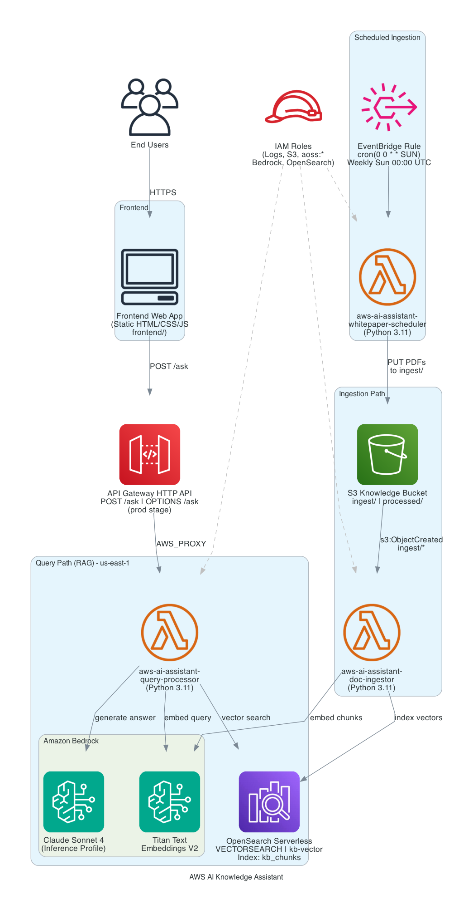
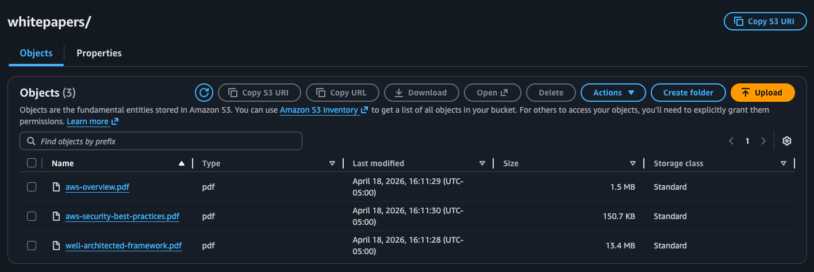
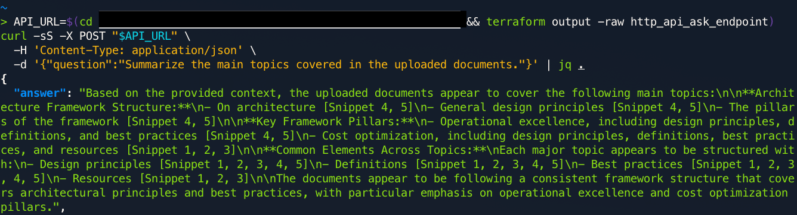
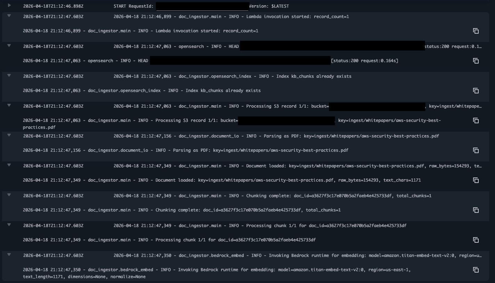
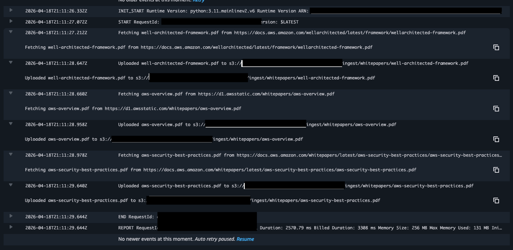

# AWS AI Knowledge Assistant

A serverless knowledge assistant on AWS that ingests documents (including PDFs), indexes them with vector embeddings, and answers natural-language questions with retrieval-augmented generation—so you can query your own corpus (or scheduled AWS whitepapers) from a browser or API.


## Architecture



ASCII overview (supplement—event and request paths):

```
                    weekly schedule
 EventBridge  ------------------------->  whitepaper_scheduler Lambda
 (Sun 00:00 UTC)                              |
                                              |  PUT PDF -> s3://.../ingest/whitepapers/

 Browser / curl ----POST /ask----> API Gateway (HTTP) ----> query_processor Lambda
       |                              |                         +---> Bedrock (embed + Claude)
       |                              |                         |
       |                              |                         +---> OpenSearch Serverless (kNN)
       |
       +---- upload .txt / .pdf ----> S3 bucket (ingest/, ingest/whitepapers/)
                                              |
                                   S3 ObjectCreated
                                              |
                                              v
                                    doc_ingestor Lambda (chunk -> embed -> index)
```

## How it works

1. **Ingest trigger** — Upload a `.txt` or `.pdf` under the bucket `ingest/` prefix (or rely on the weekly job). S3 `ObjectCreated` events invoke **`doc_ingestor`**.
2. **Chunking and embedding** — **`doc_ingestor`** loads the object from S3 (UTF-8 text or PDF via `pypdf`), splits text into ~1200-character chunks, calls **Amazon Bedrock** (Titan Embed Text v2, 1024-dim vectors), and upserts documents into the **`kb_chunks`** index in **OpenSearch Serverless** (kNN / cosine).
3. **Scheduled corpus refresh** — **EventBridge** runs **`whitepaper_scheduler`** weekly (Sunday 00:00 UTC). It downloads a small fixed list of AWS PDF whitepapers, writes them to `ingest/whitepapers/…` if not already present, which reuses the same ingestion path.
4. **Question path** — The client **`POST`s JSON** `{"question":"…"}` to the **HTTP API** `/ask` route. **`query_processor`** embeds the question, runs kNN retrieval (top chunks), then calls **Bedrock** (Claude—model ID / inference profile from Terraform) with a system prompt and retrieved context.
5. **Response** — The API returns JSON with an **`answer`** and **`sources`** (snippet text, S3 URI, score). The static **frontend** reads the invoke URL from `frontend/config/config.js` and displays the result.

## Key design decisions

### 1. OpenSearch Serverless for vectors (not a self-managed cluster)

Vector search stays fully managed: no data nodes to patch, and IAM-based data access fits Lambda execution roles. Tradeoff: collection and policy setup is more verbose in Terraform than “a single OpenSearch domain resource,” but operational load is lower for a demo/portfolio footprint.

### 2. Separate zip packages + one shared dependency layer

**`doc_ingestor`** and **`query_processor`** are packaged as two **`archive_file`** zips from `terraform/lambda/`, while **`opensearch-py`**, **`requests-aws4auth`**, and **`pypdf`** live in a **shared Lambda layer** built with `pip` during `terraform plan`/`apply`. That keeps function bundles small and avoids duplicating heavy deps, at the cost of tying layer rebuilds to the machine running Terraform with network access to PyPI.

### 3. PDFs in the ingest path (not a separate pipeline)

Text and PDFs share one code path in **`document_io.py`**: content type / extension routes to plain decode or `pypdf`. Tradeoff: very large or scanned PDFs are not OCR’d; the stack optimizes for text-based docs and typical whitepapers.

### 4. Optional weekly whitepapers without a separate crawler service

**`whitepaper_scheduler`** is a single small Lambda on a schedule, idempotent via **`HeadObject`** before **`PutObject`**. Tradeoff: the URL list is code-defined, not a CMS—good for a predictable seed corpus, not for arbitrary web crawling.

### 5. HTTP API without a built-in authorizer

The default stack exposes **`/ask`** with CORS for browser use. Tradeoff: fastest path to a working UI; production would add API keys, JWT, IAM, or private integration and tighten **`AllowFromPublic`** on OpenSearch if policy requires it.

## AWS services used

- **Amazon S3** — Document storage; `ingest/` triggers ingestion; scheduled whitepapers land under `ingest/whitepapers/`.
- **AWS Lambda** — **`doc_ingestor`** (S3-driven indexing), **`query_processor`** (HTTP ask endpoint), **`whitepaper_scheduler`** (scheduled downloads).
- **Amazon API Gateway (HTTP API)** — Public **`POST /ask`** route to **`query_processor`**.
- **Amazon OpenSearch Serverless** — Vector index **`kb_chunks`** for kNN retrieval.
- **Amazon Bedrock** — Titan Embed Text v2 for embeddings; Claude (model / inference profile from variables) for generation.
- **Amazon EventBridge** — Weekly rule invoking **`whitepaper_scheduler`**.
- **AWS IAM** — Least-privilege roles and policies per function and OpenSearch data access.
- **Amazon CloudWatch Logs** — Runtime logging for all Lambdas.

## Prerequisites

### Required tools

- **AWS CLI** v2.x — [Installation guide](https://docs.aws.amazon.com/cli/latest/userguide/getting-started-install.html)
- **Terraform** (>= 1.0) — [Downloads](https://developer.hashicorp.com/terraform/downloads)
- **Python 3** (3.9+) with **pip** — used when Terraform materializes the Lambda layer

### AWS account requirements

- Credentials configured (`aws configure` or environment variables). Use **`us-east-1`** as the region; do **not** set **`AWS_REGION`** (reserved in many environments).
- Permissions to create and update: Lambda, IAM, S3, OpenSearch Serverless, API Gateway, EventBridge, CloudWatch Logs, Bedrock access for the models below.

### Bedrock model access

In the [Bedrock console](https://console.aws.amazon.com/bedrock/) → **Model access**, enable at least:

- **Amazon Titan Embed Text v2** (`amazon.titan-embed-text-v2:0`)
- Your chosen **Claude** model (see `GEN_MODEL_ID` / inference profile in Terraform); the repo default inference profile targets a current Sonnet profile—adjust in `terraform.tfvars` if your account uses a different ID.

## Setup and deployment

### 1. Clone the repository

```bash
git clone <repository-url>
cd AWS-AI-Assitant
```

### 2. Configure Terraform variables

```bash
cd terraform
cp terraform.tfvars.example terraform.tfvars
# Set bucket_name to a globally unique S3 bucket name
```

### 3. Deploy

```bash
terraform init
terraform apply
# Optional: override generation inference profile
# terraform apply -var='gen_inference_profile_id=<PROFILE_ID_OR_ARN>'
```

`terraform apply` rebuilds Lambda zips and the dependency layer when sources or `layer_requirements.txt` change. First deploy often takes on the order of **10–15 minutes**.

### 4. Point the frontend at the API

```bash
API_URL=$(terraform output -raw http_api_ask_endpoint)
cd ..
mkdir -p frontend/config
printf '%s\n' "window.APP_CONFIG = { apiEndpoint: \"$API_URL\" };" > frontend/config/config.js
```

### 5. Ingest and query

```bash
BUCKET_NAME=$(cd terraform && terraform output -raw s3_bucket_name)
aws s3 cp your-doc.txt s3://$BUCKET_NAME/ingest/your-doc.txt

API_URL=$(cd terraform && terraform output -raw http_api_ask_endpoint)
curl -X POST "$API_URL" \
  -H 'Content-Type: application/json' \
  -d '{"question": "What is this document about?"}'
```

Open **`frontend/html/index.html`** in a browser after **`config.js`** exists.

**Teardown:** Empty the S3 bucket (including versions) if `terraform destroy` complains, then run **`terraform destroy`** from **`terraform/`**.

### Terraform variables

| Variable | Description | Default |
|----------|-------------|---------|
| `aws_region` | AWS region for resources | `us-east-1` |
| `bucket_name` | Globally unique S3 bucket for documents | *Required in `terraform.tfvars`* |
| `collection_name` | OpenSearch Serverless collection name | `kb-vector` |
| `gen_inference_profile_id` | Bedrock inference profile for generation (optional ARN/ID) | `us.anthropic.claude-sonnet-4-20250514-v1:0` |

## Screenshots

### Static frontend asking the knowledge base

The browser UI loads the API URL from `frontend/config/config.js` and displays answers with sources.


### Scheduled whitepapers landing in S3

Weekly job drops AWS PDF whitepapers under `ingest/whitepapers/` so ingestion stays hands-off.



### Query API JSON response

Direct **`POST /ask`** response shape: **`answer`** plus **`sources`** with scores and S3 keys.



### Ingest Lambda processing PDFs

CloudWatch output from **`doc_ingestor`** when handling PDF objects (parse → chunk → embed path).



### Whitepaper scheduler run

Scheduled **`whitepaper_scheduler`** activity in logs (fetch, idempotent write to **`ingest/whitepapers/`**).



## Troubleshooting

### Terraform fails while installing the Lambda layer (`pip` errors)

**Root cause:** Missing Python/`pip`, no network to PyPI, or incompatible wheel resolution on the machine running Terraform.  
**Fix:** Verify `python3 -m pip --version`, ensure outbound HTTPS to PyPI, re-run `terraform apply`. If a dependency version pin fails, adjust `terraform/lambda/layer_requirements.txt` and apply again.

### Lambda `No module named '…'` at runtime

**Root cause:** Handler code import not included in the function zip, or layer not attached.  
**Fix:** Confirm `aws-ai-assistant-lambda-deps` is attached in `terraform/lambda.tf` / `lambda_packages.tf`. After dependency changes, run `terraform apply` to publish a new layer version.

### S3 upload never triggers ingestion

**Root cause:** Object not under **`ingest/`**, or event notification / permission drift.  
**Fix:** Upload to `s3://<bucket>/ingest/...`. Tail logs: `aws logs tail /aws/lambda/aws-ai-assistant-doc-ingestor --follow --region us-east-1`.

### Query returns `internal_error` or empty context

**Root cause:** Bedrock access denied, wrong model ID, OpenSearch index missing, or SigV4/endpoint mismatch.  
**Fix:** Tail **`query_processor`** logs, confirm Bedrock model access, verify `terraform output` for OpenSearch endpoint and that at least one document finished indexing (wait **1–2 minutes** after upload).

### “No 'embedding' found in model response”

**Root cause:** Titan embed model not enabled or wrong **`EMBED_MODEL_ID`**.  
**Fix:** Enable **Titan Embed Text v2** in Bedrock; check IAM **`bedrock:InvokeModel`** for the execution role.

## What I learned

- **OpenSearch Serverless policies** (encryption, network, data access) are explicit upfront work, but they replace a lot of day-2 cluster operations for a vector demo you actually want to keep running.
- **kNN index mappings** (dimension, engine, HNSW parameters) need to match the embedding model at index creation; changing them means reindexing, so locking to Titan v2’s 1024-dim vectors is a deliberate constraint.
- **Sharing a layer across Lambdas** speeds iteration, but it couples release cadence: a layer rebuild affects every consumer until you split layers or version them carefully.
- **RAG quality** is as much about chunking and citation formatting as it is about the LLM—small chunk-size choices show up immediately in retrieval noise.

## Future improvements

- Add an **API authorizer** (JWT, IAM, or API keys) and restrict **OpenSearch** network policy for non-public workloads.
- **Dead-letter queues** and **idempotency keys** for ingest retries; optional **SQS** between S3 events and **`doc_ingestor`** for back-pressure.
- **Cost and observability**: CloudWatch dashboards, alarms on Lambda errors and Bedrock throttling, and S3 lifecycle rules for large corpora.
- **Connector-based ingestion** (e.g., crawl or sync from Confluence/SharePoint) instead of a fixed whitepaper list for real org knowledge.

## Project structure

```
AWS-AI-Assitant/
├── images/                         # README diagrams and screenshots
├── frontend/
│   ├── config/config.js            # Generated API endpoint (gitignored pattern)
│   ├── html/index.html
│   ├── js/app.js
│   └── css/style.css
├── terraform/
│   ├── main.tf, variables.tf, outputs.tf
│   ├── api_gateway.tf              # HTTP API → query_processor
│   ├── lambda.tf                   # Functions, S3 trigger, EventBridge target
│   ├── lambda_packages.tf          # archive_file zips + deps layer
│   ├── opensearch.tf               # Serverless collection + policies
│   ├── s3.tf, iam.tf
│   └── lambda/
│       ├── doc_ingestor/           # S3 → chunk → embed → index
│       ├── query_processor/        # HTTP → search → Bedrock answer
│       ├── common/                 # Shared helpers
│       ├── whitepaper_scheduler.py # Weekly PDF fetch to S3
│       └── layer_requirements.txt
├── requirements.txt               # Optional local venv (boto3, clients)
└── README.md
```

---

**Cost note:** This stack consumes pay-per-use AWS services. Monitor billing and set budgets/alerts. For production, tighten security controls beyond the defaults described above.
